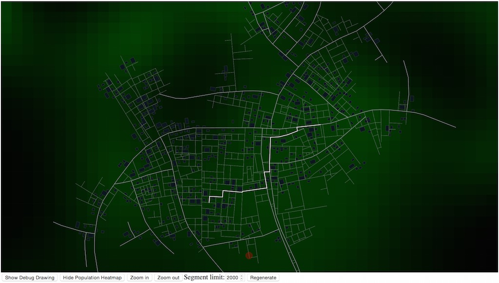

# citygen

Source code for the interactive procedural city generator found [here](http://tmwhere.com/city_generation.html).

## Building

Run:

    npm install; npm run webpack

And open `assets/index.html`.

## Ports

- Godot 3 (GDScript): https://github.com/t-mw/citygen-godot
