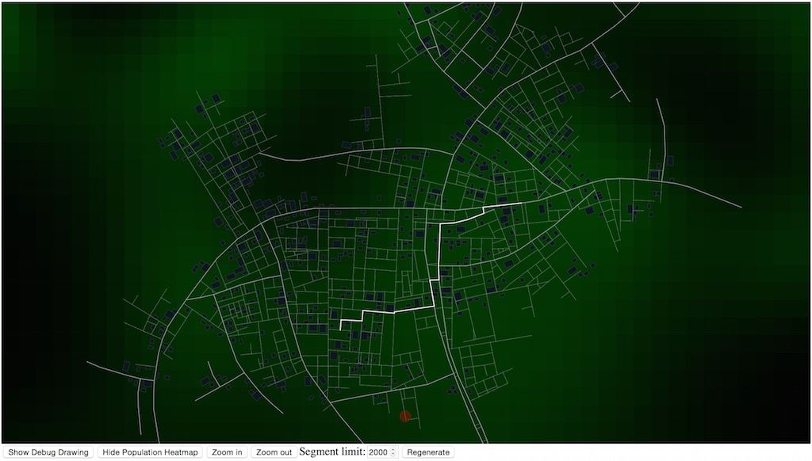

# citygen

Source code for the interactive procedural city generator found [here](http://tmwhere.com/city_generation.html).

## Development

Run:

    npm install
    npm start

## Build

Run:

    npm run build

This bundles the app with Vite into `dist/`.

## Ports

- Godot 3 (GDScript): https://github.com/t-mw/citygen-godot
